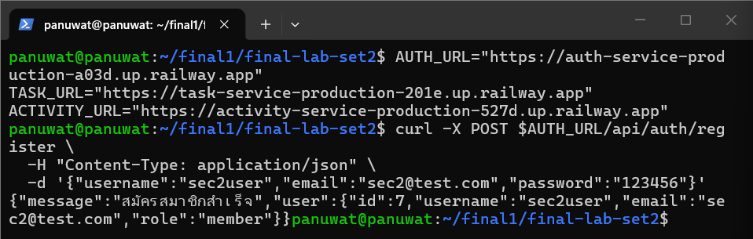
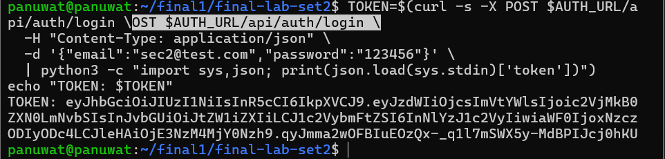
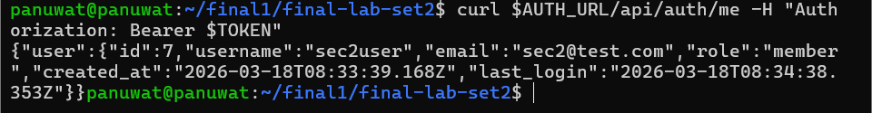
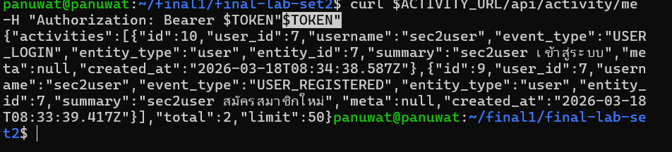
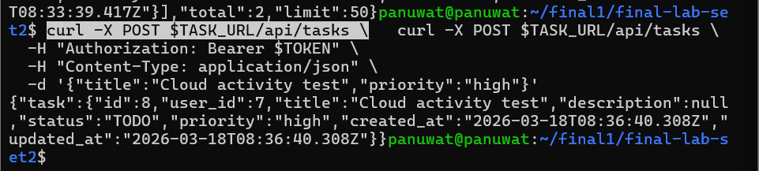
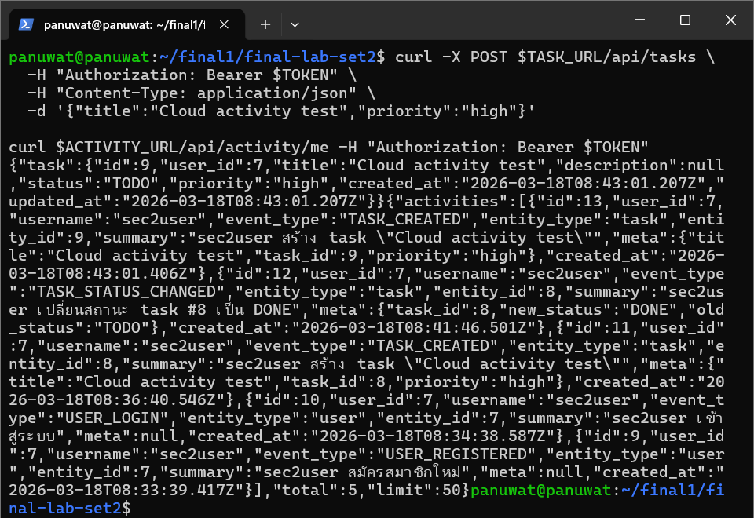
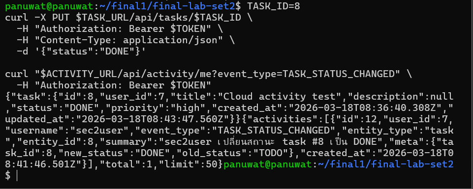
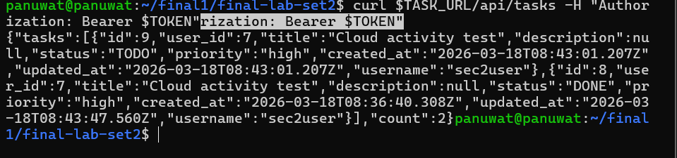
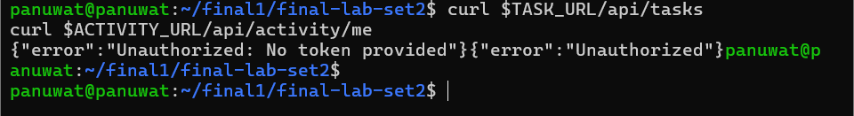
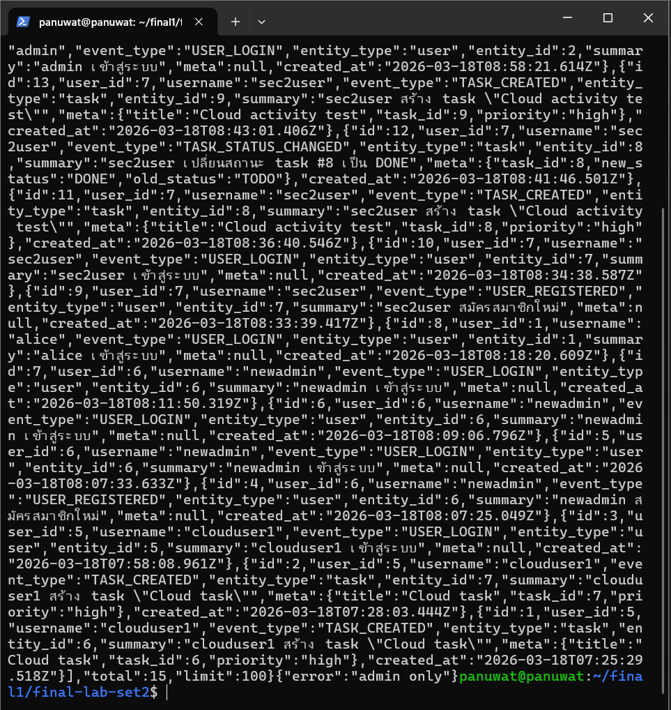

# รายงานรายบุคคล - INDIVIDUAL_REPORT_TEMPLATE-44-3.md

## ข้อมูลผู้จัดทำ
- **ชื่อ-นามสกุล**: ภานุวัฒน์ ต๋าคำ
- **รหัสนักศึกษา**: 67543210044-3
- **กลุ่ม**: 14

## ขอบเขตงานที่รับผิดชอบ
ระบุส่วนงานที่ตนเองรับผิดชอบอย่างชัดเจน เช่น:

### Backend Services
- **Auth Service**: การยืนยันตัวตนของผู้ใช้, การจัดการ JWT token, ความปลอดภัยรหัสผ่าน
- **Task Service**: การดำเนินการ CRUD สำหรับงาน, authorization middleware, การควบคุมการเข้าถึงตามบทบาท
- **Activity Service**: การบันทึก activity ข้าม service, การติดตามเหตุการณ์, timeline API

### Frontend & UI
- **เว็บแอปพลิเคชัน**: Single Page Application, การออกแบบส่วนติดต่อผู้ใช้
- **Activity Dashboard**: การแสดง activity timeline, การโต้ตอบของผู้ใช้
- **Responsive Design**: ส่วนติดต่อที่เป็นมิตรกับมือถือ, การจัดแต่ง CSS ทันสมัย

### Infrastructure & Deployment
- **Railway Deployment**: การ deploy service บน cloud, การตั้งค่า environment
- **Database Management**: การตั้งค่า PostgreSQL, การออกแบบ schema, การย้ายข้อมูล
- **Docker Configuration**: การทำ containerization, การจัดการ multi-service orchestration

### Security & Integration
- **Authentication Flow**: ความปลอดภัยแบบ JWT, การอนุญาตข้าม service
- **API Integration**: การสื่อสารระหว่าง service, การจัดการข้อผิดพลาด
- **Testing & Validation**: การทดสอบแบบ end-to-end, การตรวจสอบ API

## สิ่งที่ได้ดำเนินการด้วยตนเอง

### การพัฒนาทางเทคนิค
อธิบายสิ่งที่ลงมือพัฒนาด้วยตนเองโดยสรุป เช่น:

#### การพัฒนา Backend
- เขียน authentication routes และ JWT middleware
- พัฒนา API endpoints สำหรับการจัดการงาน
- สร้างระบบบันทึก activity ข้าม service
- ออกแบบ database schema และความสัมพันธ์

#### การพัฒนา Frontend  
- พัฒนาส่วนติดต่อผู้ใช้สำหรับเข้าสู่ระบบ/สมัครสมาชิก
- สร้าง dashboard การจัดการงาน
- ออกแบบการแสดง activity timeline
- จัดการการรวม API และการจัดการข้อผิดพลาด

#### DevOps & Deployment
- ตั้งค่าการ deploy บน Railway
- จัดการ environment variables และ secrets
- แก้ไขปัญหาการเชื่อมต่อฐานข้อมูล
- ทดสอบการ deploy production

#### Integration & Testing
- ทดสอบการสื่อสารข้าม service
- แก้ไขปัญหา CORS และการยืนยันตัวตน
- ตรวจสอบความสอดคล้องของข้อมูลระหว่าง services
- ทำการทดสอบ workflow แบบ end-to-end

## ปัญหาที่พบและวิธีการแก้ไข

### ปัญหาที่ 1: การซิงค์ฐานข้อมูล
**ปัญหา**: Task service ไม่สามารถ JOIN กับตาราง users ได้เพราะแต่ละ service ใช้ฐานข้อมูลแยกกัน

**วิธีแก้ไข**: 
- วิเคราะห์ trade-off ระหว่าง shared database กับ separate databases
- เลือกใช้ separate databases เพื่อความเป็นอิสระของ service
- สร้างตาราง users ในทุกฐานข้อมูลที่ต้องใช้
- ออกแบบกลยุทธ์การซิงค์ข้อมูล

**สิ่งที่ได้เรียนรู้**: การออกแบบฐานข้อมูลใน microservices ต้องพิจารณาความสอดคล้องของข้อมูลกับความเป็นอิสระของ service

### ปัญหาที่ 2: การยืนยันตัวตนข้าม Service
**ปัญหา**: JWT token ที่สร้างจาก auth-service ใช้ไม่ได้กับ services อื่น

**วิธีแก้ไข**:
- ตรวจสอบ JWT_SECRET ให้เหมือนกันทุก service
- ออกแบบ shared authentication middleware
- ทดสอบการตรวจสอบ token ข้าม services
- จัดการการหมดอายุและการรีเฟรช token

**สิ่งที่ได้เรียนรู้**: Shared secrets และการจัดการ token เป็นสิ่งสำคัญใน distributed systems

### ปัญหาที่ 3: การตั้งค่าการ Deploy บน Railway
**ปัญหา**: Services deploy ไม่สำเร็จเพราะ environment variables และ dependencies

**วิธีแก้ไข**:
- ศึกษากระบวนการ deploy ของ Railway
- จัดการ environment variables อย่างเป็นระบบ
- แก้ไข Dockerfile และ service dependencies
- ทดสอบการ deploy ทีละ service

**สิ่งที่ได้เรียนรู้**: การ deploy บน cloud ต้องพิจารณา service dependencies และการจัดการ configuration

## สิ่งที่ได้เรียนรู้จากงานนี้

### เชิงเทคนิค (Technical Learning)
- **สถาปัตยกรรม Microservices**: การออกแบบ service boundaries และ communication patterns
- **การยืนยันตัวตน JWT**: Token-based authentication ใน distributed systems
- **การออกแบบฐานข้อมูล**: Trade-offs ระหว่าง shared กับ separate databases
- **การออกแบบ API**: การออกแบบ RESTful API และการจัดการข้อผิดพลาด
- **Docker & Deployment**: Containerization และกลยุทธ์การ deploy บน cloud
- **การรวมข้าม Service**: การสื่อสารระหว่าง service และ event-driven architecture

### เชิงสถาปัตยกรรม (Architectural Learning)
- **การแยก Service**: การแยก concerns ระหว่าง authentication, business logic และ logging
- **ความสอดคล้องของข้อมูล**: การจัดการความสอดคล้องของข้อมูลใน distributed systems
- **สถาปัตยกรรมความปลอดภัย**: Authentication และ authorization ข้าม services
- **การพิจารณา Scalability**: การออกแบบระบบที่สามารถ scale ได้
- **Fault Tolerance**: การจัดการ service failures และ error propagation

### เชิงการทำงานร่วมกัน (Collaboration Learning)
- **การประสานงานทีม**: การประสานงานในการพัฒนา microservices
- **การจัดการ API Contract**: การกำหนดและรักษา API contracts
- **กระบวนการ Code Review**: การ review โค้ดข้าม services
- **การทดสอบการรวม**: การทดสอบระบบแบบ end-to-end
- **การจัดทำเอกสาร**: การจัดทำเอกสารสำหรับ distributed systems

## แนวทางการพัฒนาต่อไปใน Set 2

### การปรับปรุง Service
- **User Service**: แยกการจัดการผู้ใช้ออกจาก auth service
- **Notification Service**: เพิ่ม real-time notifications สำหรับการอัปเดตงาน
- **File Service**: เพิ่มการอัปโหลดและจัดการไฟล์แนบในงาน
- **Audit Service**: เพิ่ม detailed audit logging สำหรับ compliance

### การปรับปรุง Infrastructure
- **API Gateway**: เพิ่ม centralized API gateway สำหรับ routing และ rate limiting
- **Service Discovery**: ใช้ service registry สำหรับ dynamic service discovery
- **Load Balancing**: เพิ่ม load balancer สำหรับ high availability
- **Monitoring & Observability**: เพิ่ม metrics, tracing และ health checks

### การปรับปรุงความปลอดภัย
- **OAuth2/OIDC**: อัปเกรดเป็น standard authentication protocols
- **API Rate Limiting**: เพิ่ม rate limiting และ DDoS protection
- **Encryption**: เพิ่ม data encryption at rest และ in transit
- **Audit Trails**: เพิ่ม comprehensive audit logging

### การจัดการข้อมูล
- **Event Sourcing**: ใช้ event sourcing สำหรับ activity tracking
- **CQRS Pattern**: แยก read และ write operations
- **Data Replication**: เพิ่ม data replication สำหรับ high availability
- **Backup & Recovery**: เพิ่ม automated backup และ disaster recovery

### กระบวนการพัฒนา
- **CI/CD Pipeline**: เพิ่ม automated testing และ deployment
- **Infrastructure as Code**: ใช้ Terraform หรือเครื่องมือคล้ายกัน
- **Container Orchestration**: ใช้ Kubernetes สำหรับ production deployment
- **Performance Testing**: เพิ่ม load testing และ performance monitoring

## บทสรุป

การทำงานใน Final Lab Set 2 ให้ประสบการณ์ที่มีค่าในการพัฒนาระบบ microservices จริง ตั้งแต่การออกแบบสถาปัตยกรรม การแก้ไขปัญหาทางเทคนิค ไปจนถึงการ deploy บน production ความรู้และประสบการณ์ที่ได้จะเป็นพื้นฐานสำคัญสำหรับการพัฒนาระบบที่ซับซ้อนมากขึ้นในอนาคต