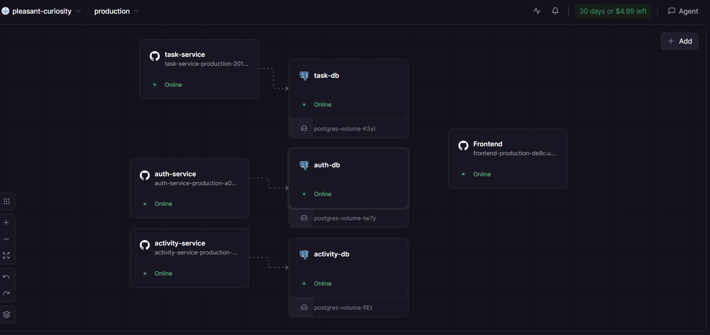

# ENGSE207 Software Architecture  
## README — Final Lab Set 2: Microservices + การ Deploy บน Cloud + การติดตาม Activity

> เอกสารฉบับนี้ใช้เป็น `README.md` สำหรับ repository ของ **Final Lab Set 2**  
> นักศึกษาสามารถปรับแก้รายละเอียด เช่น ชื่อสมาชิก, ภาพ architecture, URL หรือคำอธิบายเพิ่มเติม ให้สอดคล้องกับงานจริงของกลุ่ม

---

## 1. ข้อมูลรายวิชาและสมาชิก

**รายวิชา:** ENGSE207 Software Architecture  
**ชื่องาน:** Final Lab — ชุดที่ 2: Microservices + การ Deploy บน Cloud + การติดตาม Activity  

**สมาชิกในกลุ่ม**
- ชื่อ-สกุล / รหัสนักศึกษา: นาย ภานุวัฒน์ ต๋าคำ / รหัสนักศึกษา: 67543210044-3
- ชื่อ-สกุล / รหัสนักศึกษา: นาย เอกพันธ์ ทศทิศรังสรรค์ / รหัสนักศึกษา: 67543210050-0

**Repository:** `final-lab-set2/`


---

## 2. ภาพรวมของระบบ

Final Lab ชุดที่ 2 เป็นการพัฒนาระบบจัดการงานแบบ Microservices โดยเน้นหัวข้อสำคัญดังนี้

- การทำงานแบบแยก service บน Cloud Platform (Railway)
- การใช้ฐานข้อมูลแยกสำหรับแต่ละ service
- การยืนยันตัวตนด้วย JWT ข้าม services
- การจัดเก็บ activity logs แบบ cross-service event tracking
- การเชื่อมต่อ Frontend กับ Backend ผ่าน HTTPS
- การมี User Registration และ Role-based Authorization

งานชุดนี้ **มีการสมัครสมาชิก** และรองรับ **การสร้างผู้ใช้แบบไดนามิก** พร้อม Activity Tracking


---

## 3. วัตถุประสงค์ของงาน

งานนี้มีจุดมุ่งหมายเพื่อฝึกให้นักศึกษาสามารถ

- ออกแบบระบบแบบ Microservices ในระดับ Production
- Deploy services บน Cloud Platform (Railway)
- ใช้ฐานข้อมูลแยกสำหรับแต่ละ service
- ออกแบบการสื่อสารข้าม service และ event tracking
- จัดการการยืนยันตัวตนและอนุญาตข้าม services
- ออกแบบการบันทึก activity และระบบ timeline

---

## 4. ภาพรวมสถาปัตยกรรม


```text
Internet
    │
    │ HTTPS
    ▼
Railway Cloud Platform
├── Frontend Service (Nginx)
├── Auth Service + auth-db
├── Task Service + task-db  
├── Activity Service + activity-db
└── PostgreSQL instances แยกกัน
```

### Services ที่ใช้ในระบบ
- **frontend** — Single Page Application สำหรับการจัดการงาน
- **auth-service** — การสมัครสมาชิก, เข้าสู่ระบบ, การจัดการ JWT
- **task-service** — การดำเนินการ CRUD สำหรับงาน
- **activity-service** — การติดตาม Activity ข้าม Service
- **ฐานข้อมูลแยก** — แต่ละ service มีฐานข้อมูลของตัวเอง

---

## 5. โครงสร้าง Repository

```text
final-lab-set2/
├── README.md
├── TEAM_SPLIT.md
├── INDIVIDUAL_REPORT_[studentid].md
├── docker-compose.yml
├── .env.example
├── frontend/
├── auth-service/
├── task-service/
├── activity-service/
├── nginx/
├── scripts/
└── screenshots/
```

---

## 6. เทคโนโลยีที่ใช้

- **Backend**: Node.js, Express.js
- **ฐานข้อมูล**: PostgreSQL (instances แยกกัน)
- **การยืนยันตัวตน**: JWT (jsonwebtoken)
- **การเข้ารหัสรหัสผ่าน**: bcryptjs
- **Frontend**: Vanilla JavaScript, HTML, CSS
- **Web Server**: Nginx
- **การ Deploy**: Railway Cloud Platform
- **Containerization**: Docker


---

## 7. URLs ของ Services ที่ Deploy แล้ว

### Production Services
- **Frontend**: https://final-lab-set2-production-c9xx.up.railway.app
- **Auth Service**: https://auth-service-production-a03d.up.railway.app
- **Task Service**: https://task-service-production-201e.up.railway.app
- **Activity Service**: https://activity-service-production-527d.up.railway.app



---

## 8. API Endpoints

### Auth Service (`/api/auth`)
- `POST /register` - สมัครสมาชิกใหม่
- `POST /login` - เข้าสู่ระบบ (คืนค่า JWT)
- `GET /verify` - ตรวจสอบ JWT token
- `GET /me` - ดูข้อมูลผู้ใช้ปัจจุบัน
- `GET /health` - ตรวจสอบสถานะ service

### Task Service (`/api/tasks`)
- `GET /` - ดูรายการงาน (ของตัวเองหรือทั้งหมดถ้าเป็น admin)
- `POST /` - สร้างงานใหม่
- `PUT /:id` - แก้ไขงาน
- `DELETE /:id` - ลบงาน
- `GET /health` - ตรวจสอบสถานะ service

### Activity Service (`/api/activity`)
- `GET /me` - ดู activities ของผู้ใช้
- `GET /all` - ดู activities ทั้งหมด (admin เท่านั้น)
- `POST /internal` - endpoint ภายในสำหรับ cross-service events
- `GET /health` - ตรวจสอบสถานะ service


---

## 9. การทดสอบระบบ

### ขั้นตอนการทดสอบแบบสมบูรณ์
```bash
# ตั้งค่า URLs
AUTH_URL="https://auth-service-production-a03d.up.railway.app"
TASK_URL="https://task-service-production-201e.up.railway.app"
ACTIVITY_URL="https://activity-service-production-527d.up.railway.app"

# สมัครสมาชิกใหม่
curl -X POST $AUTH_URL/api/auth/register \
  -H "Content-Type: application/json" \
  -d '{"username":"testuser","email":"test@example.com","password":"123456"}'

# เข้าสู่ระบบและรับ token
TOKEN=$(curl -s -X POST $AUTH_URL/api/auth/login \
  -H "Content-Type: application/json" \
  -d '{"email":"test@example.com","password":"123456"}' \
  | python3 -c "import sys,json; print(json.load(sys.stdin)['token'])")

# สร้างงานใหม่
curl -X POST $TASK_URL/api/tasks \
  -H "Authorization: Bearer $TOKEN" \
  -H "Content-Type: application/json" \
  -d '{"title":"งานทดสอบ","priority":"high"}'

# ดู activities
curl $ACTIVITY_URL/api/activity/me -H "Authorization: Bearer $TOKEN"

# ทดสอบการเข้าถึงโดยไม่มีสิทธิ์
curl $TASK_URL/api/tasks  # ควรได้ 401
```


---

## 10. การยืนยันตัวตนและอนุญาต

### การยืนยันตัวตนแบบ JWT
- **JWT Secret ที่ใช้ร่วมกัน** ข้าม services
- **การหมดอายุของ Token**: 1 ชั่วโมง
- **การเข้าถึงตามบทบาท**: member/admin

### บทบาทผู้ใช้
- **Member**: สามารถจัดการงานของตัวเองได้
- **Admin**: สามารถดูงานและ activities ทั้งหมดได้


---

## 11. ระบบติดตาม Activity

### เหตุการณ์ที่ติดตาม
- `USER_REGISTERED` - การสมัครสมาชิกใหม่
- `USER_LOGIN` - การยืนยันตัวตนของผู้ใช้
- `TASK_CREATED` - การสร้างงานใหม่
- `TASK_STATUS_CHANGED` - การอัปเดตสถานะงาน
- `TASK_DELETED` - การลบงาน

### การรวมข้าม Service
- **Auth Service** → ส่ง user events ไป Activity Service
- **Task Service** → ส่ง task events ไป Activity Service
- **Activity Service** → รวบรวมและแสดง timeline


---

## 12. สถาปัตยกรรมฐานข้อมูล

### กลยุทธ์ฐานข้อมูลแยก
- **auth-db**: บัญชีผู้ใช้และ authentication logs
- **task-db**: งานและ task-related logs + ตาราง users (สำหรับ JOIN)
- **activity-db**: Activity timeline และ cross-service events

### การซิงค์ข้อมูล
- ตาราง Users ถูก replicate ใน task-db เพื่อการ JOIN
- Activity events ถูกส่งแบบ fire-and-forget
- Local logs ในฐานข้อมูลของแต่ละ service


---

## 13. การพัฒนาในเครื่อง

### ข้อกำหนดเบื้องต้น
- Docker และ Docker Compose
- Node.js (สำหรับการทดสอบ)
- Python 3 (สำหรับ JSON parsing ใน scripts)

### ขั้นตอนการตั้งค่า
1. **Clone repository**
```bash
git clone <repository-url>
cd final-lab-set2
```

2. **ตั้งค่า environment variables**
```bash
cp .env.example .env
# แก้ไข .env ตามการตั้งค่าของคุณ
```

3. **เริ่ม services**
```bash
docker-compose up -d
```

4. **เข้าถึงแอปพลิเคชัน**
- Frontend: http://localhost:80
- Auth Service: http://localhost:3001
- Task Service: http://localhost:3002
- Activity Service: http://localhost:3003


---

## 14. Environment Variables

### จำเป็นสำหรับทุก services:
- `JWT_SECRET` - Secret ที่ใช้ร่วมกันสำหรับ JWT tokens
- `DATABASE_URL` - PostgreSQL connection string
- `NODE_ENV` - Environment (development/production)

### เฉพาะ Service:
- `ACTIVITY_SERVICE_URL` - URL สำหรับ activity service (auth & task services)
- `PORT` - Port ของ service (ค่าเริ่มต้น: auth:3001, task:3002, activity:3003)

---

## 15. Screenshots ที่แนบในงาน

โฟลเดอร์ `screenshots/` ของกลุ่มนี้ประกอบด้วยภาพดังต่อไปนี้

- `01.png` - การ deploy บน Railway
- `02.png` - หน้าจอเข้าสู่ระบบของ frontend
- `03.png` - การสมัครสมาชิกผู้ใช้
- `04.png` - การจัดการงาน
- `05.png` - Activity timeline
- `06.png` - Admin dashboard
- `07.png` - การทดสอบ API
- `08.png` - โครงสร้างฐานข้อมูล
- `09.png` - การยืนยันตัวตนข้าม service
- `10.png` - Production URLs
- `railway.png` - Railway deployment overview

---

## 16. การแบ่งงานของทีม

รายละเอียดการแบ่งงานของสมาชิกอยู่ในไฟล์:

- `TEAM_SPLIT.md`

และรายงานรายบุคคลของสมาชิกแต่ละคนอยู่ในไฟล์:

- `INDIVIDUAL_REPORT_[studentid].md`

---

## 17. ปัญหาที่พบและแนวทางแก้ไข

### การซิงค์ฐานข้อมูล
**ปัญหา**: Task service ไม่สามารถ JOIN กับตาราง users ได้
**แก้ไข**: Replicate ตาราง users ใน task-db และซิงค์ข้อมูล

### การยืนยันตัวตนข้าม Service
**ปัญหา**: JWT token ใช้ไม่ได้ข้าม services
**แก้ไข**: ตั้งค่า JWT_SECRET ให้เหมือนกันทุก service

### การ Deploy บน Railway
**ปัญหา**: Environment variables และ service dependencies
**แก้ไข**: จัดการ variables อย่างเป็นระบบและทดสอบทีละ service

---

## 18. ข้อจำกัดของระบบ

- ใช้ฐานข้อมูลแยกแต่ยังต้องซิงค์ตาราง users แบบ manual
- Activity events เป็นแบบ fire-and-forget (ไม่มี guaranteed delivery)
- ยังไม่มี API Gateway สำหรับ centralized routing
- เหมาะสำหรับการเรียนรู้ microservices และการ deploy บน cloud

---

## 19. การต่อยอดในอนาคต

### การปรับปรุง Service
- เพิ่ม User Service แยกจาก Auth Service
- เพิ่ม Notification Service สำหรับ real-time updates
- เพิ่ม File Service สำหรับ file attachments

### การปรับปรุง Infrastructure
- เพิ่ม API Gateway สำหรับ centralized routing
- เพิ่ม Service Discovery และ Load Balancing
- เพิ่ม Monitoring และ Observability tools

### การจัดการข้อมูล
- ใช้ Event Sourcing สำหรับ activity tracking
- เพิ่ม Data Replication strategies
- เพิ่ม Backup และ Disaster Recovery

---

## 20. ภาคผนวก

### ไฟล์สำคัญใน repository
- `docker-compose.yml` - การตั้งค่าการพัฒนาในเครื่อง
- `auth-service/src/routes/auth.js` - Authentication endpoints
- `task-service/src/routes/tasks.js` - Task management endpoints
- `activity-service/src/index.js` - Activity tracking service
- `frontend/index.html` - เว็บแอปพลิเคชันหลัก
- `frontend/config.js` - การตั้งค่า frontend service

### คำสั่งที่มีประโยชน์
```bash
# ทดสอบ health ของ services ทั้งหมด
curl https://auth-service-production-a03d.up.railway.app/api/auth/health
curl https://task-service-production-201e.up.railway.app/api/tasks/health
curl https://activity-service-production-527d.up.railway.app/api/activity/health

# สร้าง bcrypt hash สำหรับการทดสอบ
node -e "const b=require('bcryptjs'); console.log(b.hashSync('password123',10))"
```

---

> เอกสารฉบับนี้เป็น README สำหรับงาน Final Lab Set 2 ของกลุ่ม และจัดทำเพื่อประกอบการส่งงานในรายวิชา ENGSE207 Software Architecture